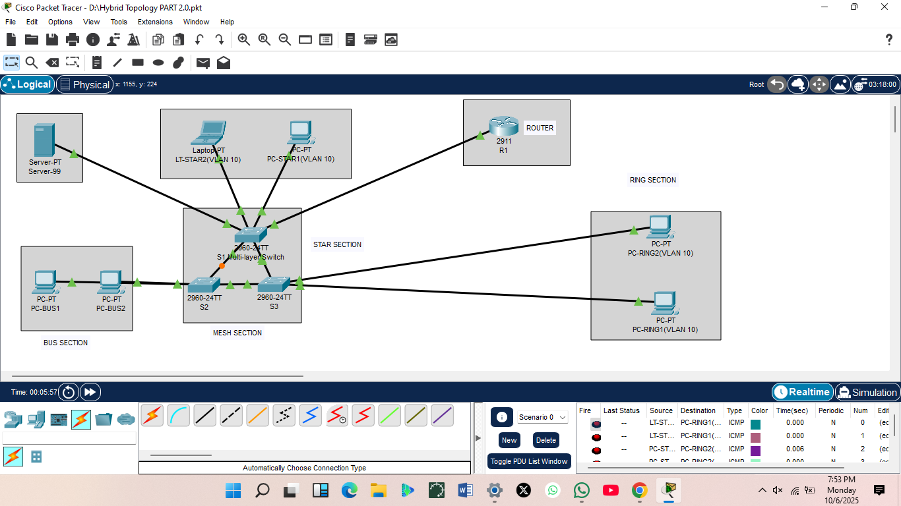
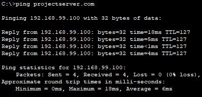
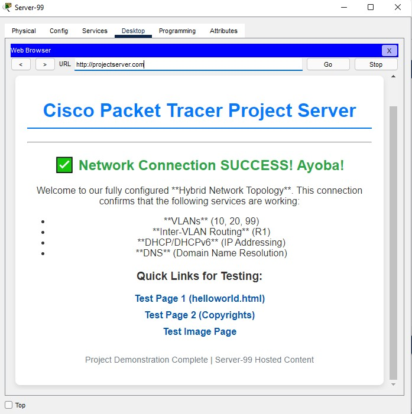
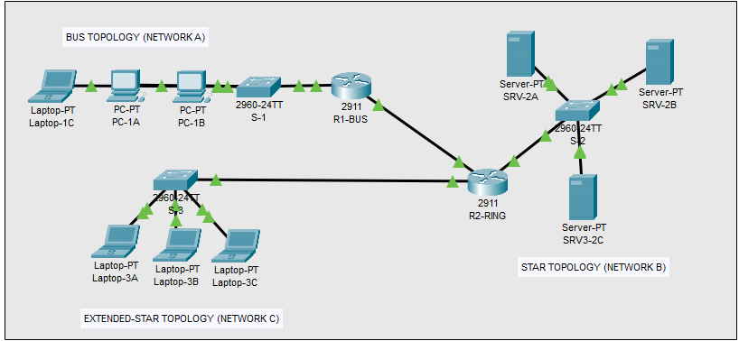

# CMPG 325 – Computer Networks Individual Project (Part 1)

**Name:** THATO DITLHAKE
**Student Number:** 36389676  
**Campus:** NWU Mafikeng  
**Part:** Network Topologies Design & Simulation  
**Deadline:** 13 October 2025

---

## 1. Overview
This project demonstrates the design and simulation of five basic topologies — Bus, Mesh, Star, Ring, and Extended Star — using Cisco Packet Tracer.  
It also includes one Hybrid Topology that integrates features of the above and is configured with IPv4, IPv6, VLANs, and a DHCP/HTTP server.

# 🌐 Network Design Project - Part 1: Hybrid Topology & Inter-VLAN Services

## Overview

This project documents the design, configuration, and verification of a **Hybrid Network Topology**. The primary goal was to create a robust, segmented network utilizing Inter-VLAN Routing (Router-on-a-Stick) to connect three distinct VLANs while providing core infrastructure services (DHCP, DNS, HTTP) over both **IPv4 and IPv6** protocols.

---

## 📐 Project Topology Structure

The final topology is a **Hybrid Architecture** combining foundational structures and featuring a fully meshed core for redundancy.

### 1. Foundational Topologies (Proof of Concept)

The project includes preliminary designs for the following foundational topologies:

| Topology | Packet Tracer File | Verification Screenshot |
| :---: | :---: | :--- |
| **Bus** | [Bus.pkt](Topologies/Bus.pkt) | [Bus Ping Test Image](PingTest/bus_ping_test.jpg) |
| **Star** | [Star.pkt](Topologies/Star.pkt) | [Star Ping Test Image](PingTest/star_ping_test.jpg) [Star Ping Test Image](PingTest/star_ping_test1.jpg) |
| **Ring** | [Ring.pkt](Topologies/Ring.pkt) | [Ring Ping Test Image](PingTest/ring_ping_test.jpg) |
| **Mesh** | [Mesh.pkt](Topologies/Mesh.pkt) | [Mesh Ping Test Image](PingTest/mesh_ping_test.jpg) [Mesh Ping Test Image](PingTest/mesh_ping_test1.jpg) |
| **Extended Star**| [ExtendedStar.pkt](Topologies/ExtendedStar.pkt) | [Extended Ping Test Image](PingTest/extended_star_ping_test.jpg) |

### IPv4 Verification for Foundational Topologies

The following screenshots verify successful IPv4 configuration (either static or DHCP) for all five foundational network structures developed in Phase 1
| Bus Topology | Star Topology | Ring Topology |
| :---: | :---: | :---: |
|  |  |  |

| Mesh Topology | Extended Star Topology |
| :---: | :---: |
|  |  |

### 2. Final Hybrid Network Segmentation (VLANs)

The hybrid network is logically segmented into three VLANs with R1 acting as the gateway for all subnets.

| VLAN ID | Name | IPv4 Subnet | IPv6 Prefix | Gateway Address (R1) |
| :---: | :---: | :--- | :--- | :--- |
| **10** | STAFF | 192.168.10.0/24 | 2001:DB8:ACAD:10::/64 | 192.168.10.1 |
| **20** | STUDENTS | 192.168.20.0/24 | 2001:DB8:ACAD:20::/64 | 192.168.20.1 |
| **99** | SERVERS | 192.168.99.0/24 | 2001:DB8:ACAD:99::/64 | 192.168.99.1 |

---

## 🛠 Configuration and Documentation

### 1. Detailed IP Addressing

All static and dynamic IP assignments for the final Hybrid Topology are documented below.

* [View Detailed IP Address Table (CSV)](IP-TABLES/hybrid_topology_iptable.csv)
* **Working File:** [Hybrid_Topology](Topologies/Hybrid1.pkt)

### 2. Core Device Configurations

The following configuration files prove the critical implementations, including **DHCP Helper Addresses** (on R1) and **Trunk Port** setup (on Switches).

| Device | Key Protocols Proven | Configuration File |
| :---: | :--- | :--- |
| **Router R1** | Router-on-a-Stick, DHCP Helper, IPv6 | [r1_configs.txt](Configs/r1_configs.txt) |
| **Switch S1** | Trunking, VLAN 10/99 Access | [s1_configs.txt](Configs/s1_configs.txt) |
| **Switch S2** | Trunking, VLAN 20 Access | [s2_configs.txt](Configs/s2_configs.txt) |
| **Switch S3** | Trunking, VLAN 10 Access | [s3_configs.txt](Configs/s3_configs.txt) |
| **Server 99** | DNS, DHCP, DHCPv6, HTTP Service | [server_configs.txt](Configs/server_configs.txt) |

---

## ✅ Verification & Testing Results

All required verification tests were successful, confirming end-to-end functionality across all layers.

### 1. Final Topology View

### 2. DNS and Routing Verification

**Test:** `ping projectserver.com`

* **Purpose:** Confirms successful DHCP relay, DNS resolution, and Inter-VLAN routing across R1.
* **Result:** **0% Loss** observed.

### 3. Application Layer Verification (HTTP Service)

**Test:** Access `http://projectserver.com` via Web Browser.

* **Purpose:** Confirms Layer 7 service reachability.
* **Result:** The custom welcome page loaded successfully.

## PART II. Individual Network Feature Configuration

**Feature Implemented:** Static Routes to enable communication between different network topologies (Bus, Ring, and Extended-Star).

### 1. Correct Configuration & Functionality
| Router | Destination Network | Next-Hop IP | Command Used |
| :--- | :--- | :--- | :--- |
| **R1-BUS** | 192.168.20.0 (Ring) | **10.0.0.2** | `ip route 192.168.20.0 255.255.255.0 10.0.0.2` |
| **R1-BUS** | 192.168.30.0 (Mesh) | **10.0.0.2** | `ip route 192.168.30.0 255.255.255.0 10.0.0.2` |
| **R2-RING** | 192.168.10.0 (Bus) | **10.0.0.1** | `ip route 192.168.10.0 255.255.255.0 10.0.0.1` |

### 2. Documentation in README.md

#### A. Static Route Verification (Routing Table Output)
The **S** flags confirm the static routes.

**R1-BUS Routing Table Evidence:**

**R2-RING Routing Table Evidence:**

#### B. Cross-Network Functionality Evidence
* **Test:** Ping from PC-1A (192.168.10.2, Bus LAN) to PC-3A (192.168.30.2,Extended-Star LAN).
* **Result:** SUCCESSFUL (0% loss)
* **Evidence:** [Screenshot](PingTest/ping_test.png)
* **Working File:** [Static_route](Topologies/static_route.pkt)

###Topology View

---

## PART III. Video Demonstration of parts I & II

### 📽️ Demo Video
[Watch the demo of PART 1 on Google Drive](https://drive.google.com/file/d/1buRZHe4q5tnzXprSrCpCRNhGq40wxzJq/view?usp=drive_link)
[Watch the demo of PART 2 on Google Drive](https://drive.google.com/file/d/1jP1Pg0kKvW-ATRYz666h72Nb4sAAjfmz/view?usp=drive_link)
